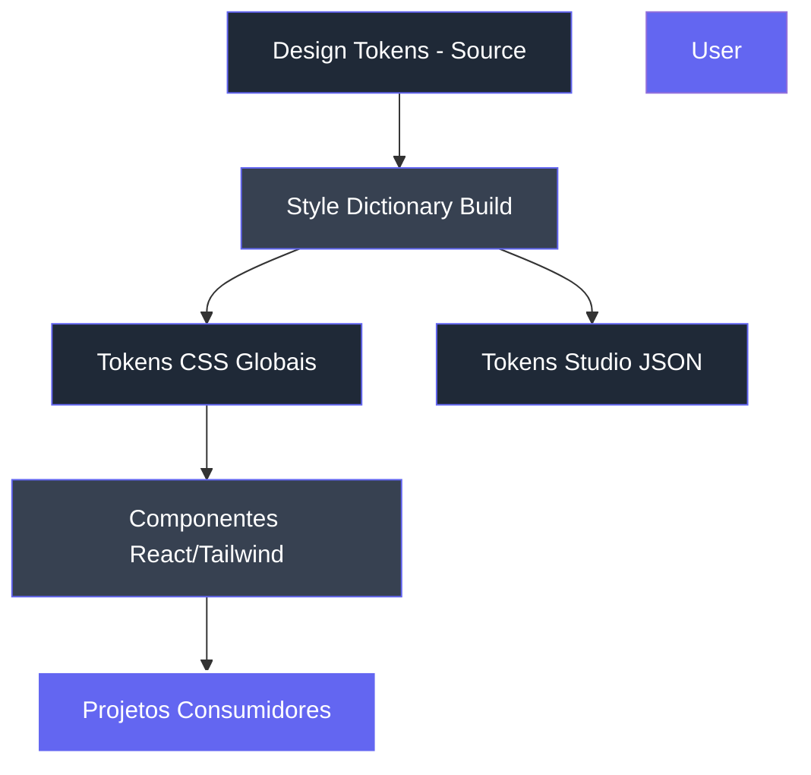

# Macro Arquitetura - GAMA_BRANDBOOK_V3

```mermaid
%%{init: {
  'theme': 'base',
  'themeVariables': {
    'primaryColor': '#1f2937',
    'primaryTextColor': '#f3f4f6',
    'lineColor': '#6366f1',
    'secondaryColor': '#374151',
    'tertiaryColor': '#111827'
  }
}%%
graph TD
    classDef main fill:#6366f1,stroke:#fff,stroke-width:2px,color:#fff;
    classDef backend fill:#374151,stroke:#6366f1,stroke-width:1px,color:#fff;
    classDef data fill:#1f2937,stroke:#6366f1,stroke-width:1px,color:#fff;

    DS[Design Tokens - Source]:::data --> Build[Style Dictionary Build]:::backend
    Build --> CSS[Tokens CSS Globais]:::data
    Build --> JSON[Tokens Studio JSON]:::data
    CSS --> Comp[Componentes React/Tailwind]:::backend
    Comp --> App[Projetos Consumidores]:::main

    style User fill:#6366f1,color:#fff
```
